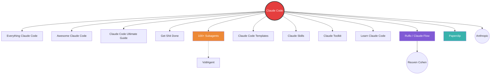

# AI Tools Knowledge Graph

> A knowledge graph of AI tools, agents, and resources sourced from Instagram DMs — visualizing connections between tools, creators, and categories.


---

## Overview

This repository contains a structured knowledge graph of AI tools, multi-agent orchestration platforms, Claude Code ecosystem resources, and related tools — all discovered through Instagram Direct Messages. Each tool is mapped with its relationships to other tools, creators, and categories.

**Source:** Instagram Direct Messages Inbox (scraped from DM conversations)
**Format:** JSON (data), Markdown (visualizations)
**Visualization:** Mermaid diagrams rendered natively on GitHub

---

## Knowledge Graph

### Entity Types

| Type | Count | Description |
|------|-------|-------------|
| **Tools** | 19 | AI tools, GitHub repos, guides, and resources |
| **People** | 10 | Creators, curators, and contributors who shared the tools |
| **Categories** | 8 | Classification buckets (Claude Code, Orchestration, Debugging, etc.) |

### Relationship Types

| Relation | Meaning |
|----------|--------|
| `references` | Tool references another tool |
| `extends` | Tool extends/adds functionality to another |
| `teaches` | Resource teaches about a tool |
| `runs_on` | Tool runs on top of another |
| `integrates_with` | Tool integrates with another |
| `alternatives` | Tools are alternatives to each other |
| `shared` | Person shared the tool in their DM |
| `created` | Person/organization created the tool |
| `recommends` | Person recommends the tool |
| `belongs_to` | Tool belongs to a category |
| `focuses_on` | Person focuses on a category |

---

## Graph Statistics

- **Total Nodes:** 29 (19 tools + 10 people)
- **Total Edges:** 45 relationships
- **Categories:** 8 (Claude Code, Orchestration, Debugging, Prompts, Guides, Marketing, Automation, Personal Branding)
- **Most Connected Node:** Claude Code (hub of 12+ dependencies)
- **Top Sharer:** Carter Perez (shared 10 Claude Code ecosystem tools)

---

## Tools by Category

### 1. Claude Code Ecosystem (10 tools)
- **Claude Code** — Anthropic's official agentic coding tool
- **Everything Claude Code** — Comprehensive resource collection
- **Awesome Claude Code** — Curated tools and resources
- **Claude Code Ultimate Guide** — In-depth guide
- **Get Shit Done** — Productivity templates
- **100+ Claude Subagents** — Specialized subagents by VoltAgent
- **Claude Code Templates** — Reusable templates
- **Claude Skills** — Skills and workflows collection
- **Awesome Claude Code Toolkit** — Comprehensive toolkit
- **Learn Claude Code** — Learning resources

### 2. AI Agent Orchestration (2 tools)
- **Ruflo (formerly Claude Flow)** — 60-100+ agent multi-agent platform by Reuven Cohen (~30K GitHub stars)
- **Paperclip** — Company-like AI agent orchestration with org charts and governance

### 3. LLM Debugging & Testing (1 tool)
- **Talc AI** — LLM session replay and debugging platform

### 4. AI Prompt Collections (1 resource)
- **ChatGPT Shared Prompts** — Curated prompt collection

### 5. AI Guides & Resources (1 guide)
- **Perplexity Mastery Guide** — Guide by God Of Prompt

### 6. AI Marketing (1 resource)
- **AI Marketing Templates** — Templates by Farhan Rakhangi

### 7. Automation & Business (1 tool)
- **Brody Automates** — Automation and business diagnostics

### 8. AI for Personal Branding
- **RuFlow Setup Guide** — Duncan Rogoff's guide for running AI agents

---

## People / Creators

| Name | Handle | Platform | Role |
|------|--------|----------|------|
| Carter Perez | certsgamified | Instagram | AI Tools Curator |
| Duncan Rogoff | duncan_rogoff | Instagram | AI for Personal Brands |
| Farhan Rakhangi | farhannrakhangi | Instagram | AI Agents & Marketing |
| Taki Wong | taki.gpt | Instagram | AI Builder |
| Anil Lobo | talc.ai | Instagram | AI Tool Creator |
| Sanskar Prajapati | aiadventureryt | Instagram | AI Educator |
| God Of Prompt | godofprompt | Instagram | AI Workflow Creator |
| Death of PC | death.of.pc | Instagram | AI Prompt Creator |
| Reuven Cohen | @ruvnet | GitHub | Creator of Ruflo/Claude Flow |
| Anthropic | anthropics | GitHub | Claude Code Creator |

---

## Repository Structure

```
ai-tools-knowledge-graph/
├── README.md                          # This file
├── data/
│   ├── knowledge-graph.json           # Structured JSON data (nodes, edges, people, categories)
│   └── visualizations/
│       └── knowledge-graph-mermaid.md # Mermaid diagram visualizations
└── ...
```

---

## Usage

### Load the Data

```javascript
// In Node.js
const data = require('./data/knowledge-graph.json');

console.log(data.nodes.length + ' tools found');
console.log(data.edges.length + ' relationships found');

// Find all Claude Code ecosystem tools
const claudeTools = data.nodes.filter(n => n.category === 'cat_claude_code');

// Find all tools shared by Carter
const carterTools = data.edges
  .filter(e => e.source === 'person_carter' && e.relation === 'shared')
  .map(e => data.nodes.find(n => n.id === e.target));
```

### Query with the Graph

```python
# In Python
import json

with open('data/knowledge-graph.json') as f:
    data = json.load(f)

# Find all tools that run_on Claude Code
running_on_claude = [
    e for e in data['edges']
    if e['relation'] == 'runs_on' and e['target'] == 'tool_claude_code'
]
print(running_on_claude)
```

---

## Key Insights from the Graph

1. **Claude Code is the central hub** — 10+ tools either reference, extend, or run on top of it
2. **Carter Perez is the top curator** — shared 10 different Claude Code ecosystem resources
3. **Multi-agent orchestration is emerging** — Ruflo (30K+ stars) and Paperclip represent the next wave
4. **The community is creator-driven** — every tool/resource traces back to a specific person
5. **Cross-category connections exist** — Claude Code tools feed into orchestration, which feeds into automation

---

## Knowledge Graph Diagram



---

## Related Repositories

| Repo | Author | Description |
|------|--------|-------------|
| [anthropics/claude-code](https://github.com/anthropics/claude-code) | Anthropic | Official Claude Code |
| [ruvnet/ruflo](https://github.com/ruvnet/ruflo) | Reuven Cohen | Multi-agent orchestration |
| [paperclipai/paperclip](https://github.com/paperclipai/paperclip) | Paperclip AI | Agent company orchestration |
| [VoltAgent/awesome-claude-code-subagents](https://github.com/VoltAgent/awesome-claude-code-subagents) | VoltAgent | 100+ Claude subagents |

---

## License

MIT License — feel free to use, extend, and share.

---

*Generated from Instagram DMs on 2026-05-02*
*Repository: github.com/ricksclick/ai-tools-knowledge-graph*
