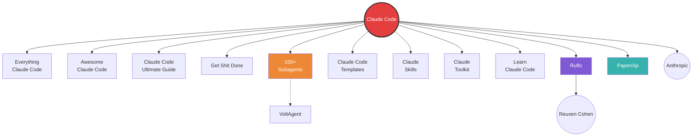
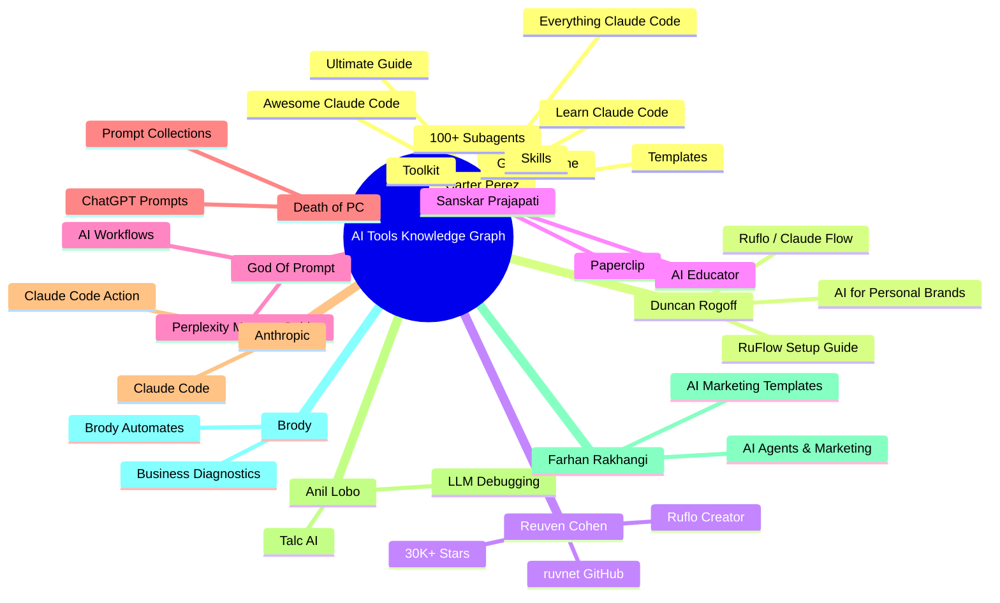

# AI Tools Knowledge Graph — Mermaid Visualization

## Overview

This document contains Mermaid diagrams visualizing the knowledge graph of AI tools, people, and their relationships.

---

## Knowledge Graph (Entity-Relationship View)

```mermaid
graph TD
    subgraph CATEGORIES["Categories"]
        cat1[Claude Code Ecosystem]
        cat2[AI Agent Orchestration]
        cat3[LLM Debugging]
        cat4[AI Prompt Collections]
        cat5[AI Guides & Resources]
        cat6[AI Marketing]
        cat7[Automation & Business]
        cat8[AI for Personal Branding]
    end

    subgraph TOOLS["AI Tools & Resources"]
        claude[Claude Code]
        everything[Everything Claude Code]
        awesome[Awesome Claude Code]
        guide[Claude Code Ultimate Guide]
        gsd[Get Shit Done]
        subagents[100+ Claude Subagents]
        templates[Claude Code Templates]
        skills[Claude Skills]
        toolkit[Claude Toolkit]
        learn[Learn Claude Code]
        voltagent[VoltAgent]
        ruflo[Ruflo / Claude Flow]
        rufloguide[RuFlow Setup Guide]
        paperclip[Paperclip]
        talc[Talc AI]
        prompts[ChatGPT Prompts]
        perplexity[Perplexity Mastery Guide]
        marketing[AI Marketing Templates]
        brody[Brody Automates]
    end

    subgraph PEOPLE["People / Creators"]
        carter[Carter Perez]
        duncan[Duncan Rogoff]
        farhan[Farhan Rakhangi]
        sanskar[Sanskar Prajapati]
        godofprompt[God Of Prompt]
        deathofpc[Death of PC]
        reuven[Reuven Cohen]
        anthro[Anthropic]
        anil[Anil Lobo]
    end

    %% Tool dependencies
    everything --> claude
    awesome --> claude
    guide --> claude
    gsd --> claude
    subagents --> claude
    templates --> claude
    skills --> claude
    toolkit --> claude
    learn --> claude
    voltagent --> subagents
    ruflo --> claude
    rufloguide --> ruflo
    paperclip --> claude
    paperclip -.-> ruflo

    %% Category mapping
    claude --> cat1
    ruflo --> cat2
    paperclip --> cat2
    talc --> cat3
    prompts --> cat4
    perplexity --> cat5
    marketing --> cat6
    brody --> cat7
    duncan --> cat8

    %% People sharing tools
    carter --> everything
    carter --> awesome
    carter --> guide
    carter --> gsd
    carter --> subagents
    carter --> templates
    carter --> skills
    carter --> toolkit
    carter --> learn
    duncan --> rufloguide
    duncan --> ruflo
    farhan --> marketing
    sanskar --> paperclip
    godofprompt --> perplexity
    deathofpc --> prompts
    reuven --> ruflo
    anthro --> claude
    anil --> talc

    %% Styling
    style CATEGORIES fill:#2d3748,stroke:#718096,color:#fff
    style TOOLS fill:#2d3748,stroke:#718096,color:#fff
    style PEOPLE fill:#2d3748,stroke:#718096,color:#fff
    style claude fill:#e53e3e,color:#fff
    style ruflo fill:#805ad5,color:#fff
    style paperclip fill:#38b2ac,color:#fff
    style carter fill:#ed8936,color:#fff
    style duncan fill:#ed8936,color:#fff
    style reuven fill:#d69e2e,color:#fff
    style anthro fill:#d69e2e,color:#fff
```

---

## Claude Code Ecosystem (Hub Graph)

---

## AI Agent Orchestration Comparison

```mermaid
graph TB
    subgraph ORCHESTRATION["AI Agent Orchestration Tools"]
        ruflo[[Ruflo / Claude Flow]]
        paperclip[[Paperclip]]
    end

    subgraph RUFLO_FEATURES["Ruflo Features"]
        rf1[60-100+ Specialized Agents]
        rf2[Swarm Topologies<br/>Mesh/Hierarchical/Ring/Star]
        rf3[215+ MCP Tools]
        rf4[Distributed Consensus<br/>Raft/BFT/Gossip/CRDT]
        rf5[30K+ GitHub Stars]
    end

    subgraph PAPERCLIP_FEATURES["Paperclip Features"]
        pf1[Company Org Charts]
        pf2[Budget & Cost Controls]
        pf3[Governance Layer]
        pf4[Ticket/Issue System]
        pf5[Audit Logging]
    end

    ruflo --> rf1
    ruflo --> rf2
    ruflo --> rf3
    ruflo --> rf4
    ruflo --> rf5

    paperclip --> pf1
    paperclip --> pf2
    paperclip --> pf3
    paperclip --> pf4
    paperclip --> pf5

    ruflo -.- alternatives[Alternative Approaches]
    paperclip -.- alternatives

    style ruflo fill:#805ad5,color:#fff
    style paperclip fill:#38b2ac,color:#fff
    style alternatives fill:#4a5568,color:#fff
```

---

## People-to-Tools Network

---

## Tool Relationship Types

| Relation Type | Description | Example |
|---|---|---|
| `references` | Tool references another tool | Everything Claude Code → Claude Code |
| `extends` | Tool extends/adds to another | Subagents → Claude Code |
| `teaches` | Resource teaches about a tool | Learn Claude Code → Claude Code |
| `runs_on` | Tool runs on top of another | Ruflo → Claude Code |
| `integrates_with` | Tool integrates with another | Paperclip → Claude Code |
| `alternatives` | Tools are alternatives to each other | Paperclip → Ruflo |
| `shared` | Person shared the tool | Carter → Everything Claude Code |
| `created` | Person created the tool | Anthropic → Claude Code |
| `recommends` | Person recommends the tool | Duncan → Ruflo |
| `belongs_to` | Tool belongs to a category | Talc → LLM Debugging |
| `focuses_on` | Person focuses on a category | Duncan → AI for Personal Branding |

---

## GitHub Repository

- **Repo:** `ricksclick/ai-tools-knowledge-graph`
- **Data:** `data/knowledge-graph.json`
- **Source:** Instagram Direct Messages Inbox
- **Created:** 2026-05-02
